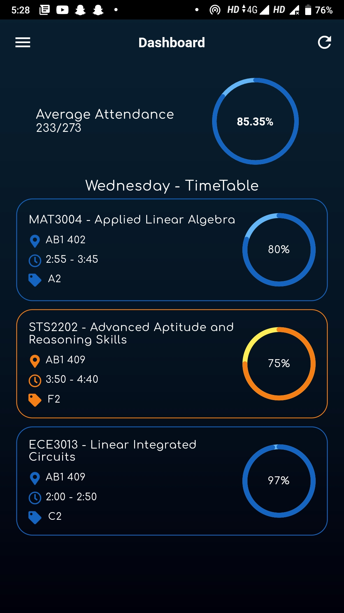
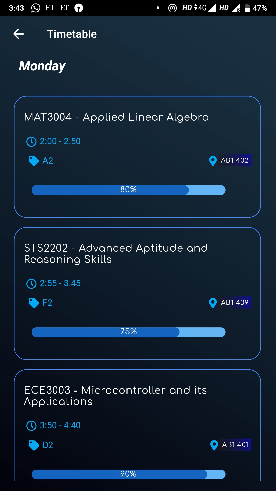
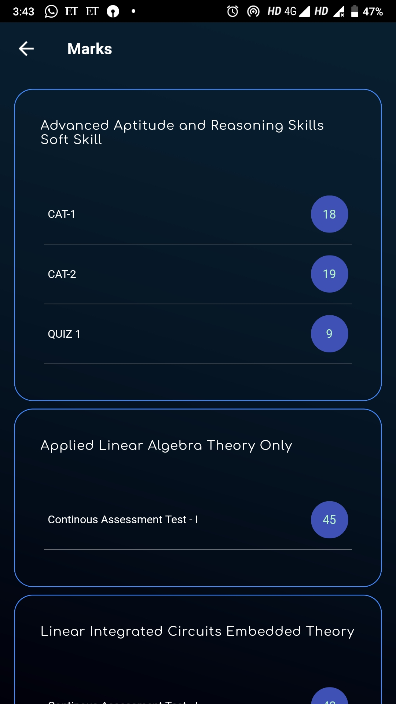
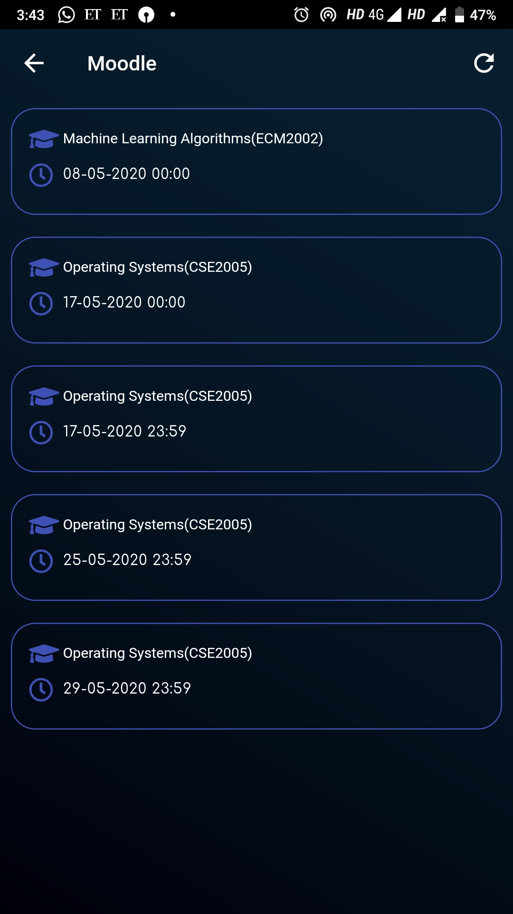
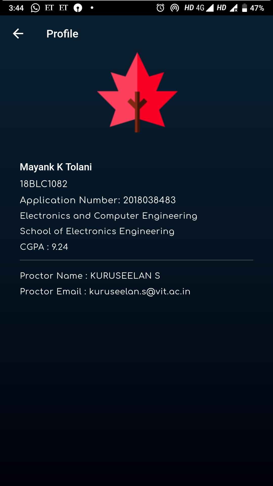

# VITask Lite

# Caution! Work in progress. 

## Beta version launched on Play Store!

VITask mobile application made for the students of VIT Chennai for their VTOP login.

## Screenshots

  
 
 
  

# Installation

* Download the Flutter SDK from https://flutter.dev/docs/get-started/install/windows
* Extract the downloaded SDK and add the location of the bin file inside the flutter package to your path variables.
* Install the flutter plugin into your Android Studio to be able to run Flutter apps.
* You're ready to go.
* Note: The above installation guidelines are only for windows.

## Contributing Guidelines

#### Fork this repo and clone the forked repo into your PC.
#### This repo is frequently updated so make sure you always pull the latest version.

### For updating a forked repo
* `git remote add upstream https://github.com/mayanktolani19/vitask-flutter.git`
* `git fetch upstream`
* `git checkout master`
* `git rebase upstream/master`
* `git push`

### Making changes to your forked repo
* `git add .`
* `git commit -m"<Describe your changes>"`
* `git push`
* After committing your changes, make Pull Request.

### To Do:
* GPA Calculator

## Our Team

<a href="https://github.com/mayanktolani19"> Mayank K Tolani 
   
<a href = "https://github.com/maa-atk"> Abhishek TK  

